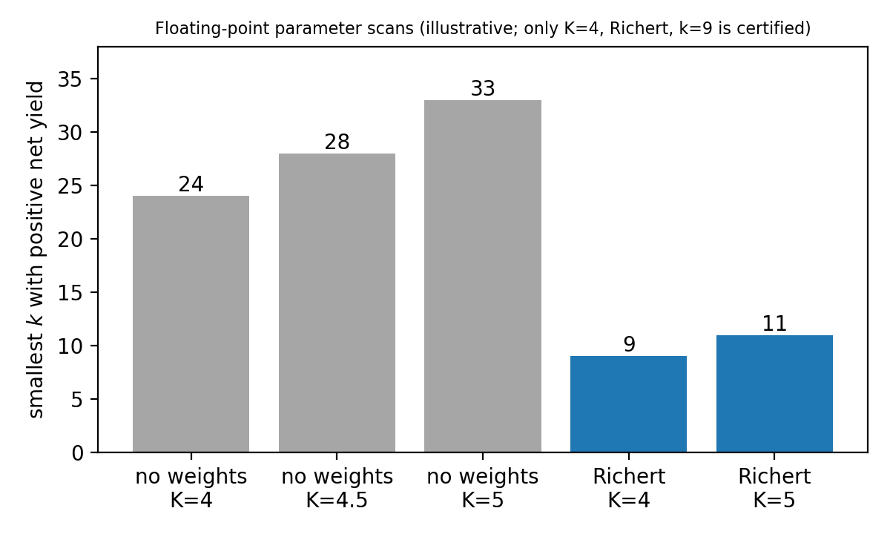

# On primes *p* for which *N − p* is an almost prime sum of two squares

[](https://doi.org/10.5281/zenodo.23133054)

**Author:** Ruqing Chen, GUT Geoservice Inc., Montreal, Canada (ruqing@hotmail.com)

This repository contains the paper, the interval-arithmetic verification script and the exploratory
computations for the following result.

> **Theorem.** For every sufficiently large even integer *N*, the number of primes *p* ≤ *N* such that
> *N − p* is a sum of two squares with Ω(*N − p*) ≤ 9 is at least (1/10)·𝔖(*N*)·*N*/(log *N*)²,
> where 𝔖(*N*) is the binary Goldbach singular series.

The method follows the vector sieve framework of Nath and Xie (Acta Arith. 223 (2026)): two semi-linear
sieves at the Bombieri–Vinogradov level, Richert's logarithmic weights, and a switching argument that
removes integers with two large prime factors ≡ 3 (mod 4).

## Status

This is a preprint. The final numerical inequality (Lemma 5.1 of the paper) is verified with
outward-rounded interval arithmetic. The analytic sieve lemmas (Sections 2–4) are written out in the
paper but have **not yet been independently refereed**, and the novelty of the statement has not yet been
confirmed by experts.

## Repository layout

```
paper/
  Chen2026_AlmostPrimeSumsOfTwoSquares.tex   AMS-LaTeX source (self-contained, no .bib needed)
  Chen2026_AlmostPrimeSumsOfTwoSquares.pdf   compiled paper
code/
  certify.py              rigorous interval-arithmetic check of the main-term inequality (k = 9)
  make_figures.py         regenerates the figures
  exploration/            floating-point scans used to choose the parameters (not certified)
    sieve_funcs.py        beta-sieve functions F, f for kappa = 1/2 and kappa = 1
    net_yield.py          vector sieve + switching, no weights
    richert.py            robustness in K and Richert weights
    richert_fine.py       finer Richert scan
results/
  certify_output.txt      output of certify.py
  float_scans_*.txt       outputs of the exploratory scans
figures/                  PNG (README) and vector PDF (paper, Figures 1-2)
  semilinear_sieve_functions.{png,pdf}
  smallest_k_by_scheme.{png,pdf}
```

## Reproducing the results

Requirements: Python ≥ 3.9 (for `math.nextafter`), numpy, mpmath, matplotlib (figures only).

```bash
pip install -r requirements.txt
python code/certify.py              # ~1 minute; prints "certified:  net >= +0.106297  ->  POSITIVE"
python code/exploration/richert.py  # floating-point scans (several minutes)
python code/make_figures.py
```

To rebuild the paper: `cd paper && pdflatex Chen2026_AlmostPrimeSumsOfTwoSquares.tex` (run twice).

### What `certify.py` proves and what it does not

For the parameters δ = 1/10, α = 7/1000, λ = 3/20, β₁ = 3/10 (so that 1/λ + 1/β₁ = 10, hence Ω ≤ 9) it
proves rigorously that

| quantity | certified bound |
|---|---|
| vector sieve lower function *L* | ≥ 0.583795 |
| Richert integral *R* | ≤ 2.050122 |
| switching density *c* | ≤ 0.339858 |
| net yield | **≥ +0.106297** |

It relies on standard properties of the semi-linear sieve functions (monotonicity, the delay-differential
equations, closed forms on (0, 3]). It does **not** verify the sieve lemmas themselves or the o(1) terms;
those are the analytic content of the paper.

## Floating-point scans (illustrative)

| scheme | switching constant K | smallest k |
|---|---|---|
| no weights | 4 / 4.5 / 5 | 24 / 28 / 33 |
| Richert weights | 4 / 5 | **9** / 11 |



## Citation

```bibtex
@misc{Chen2026AlmostPrimeTwoSquares,
  author = {Chen, Ruqing},
  title  = {On primes $p$ for which $N-p$ is an almost prime sum of two squares},
  year   = {2026},
  doi    = {10.5281/zenodo.23133054},
  url    = {https://doi.org/10.5281/zenodo.23133054}
}
```

## License

Code: MIT (see `LICENSE`). Paper (text and figures): CC BY 4.0.

## AI assistance

Parts of the computations and of the draft were produced with the help of the Claude language model.
The author is responsible for the content.
